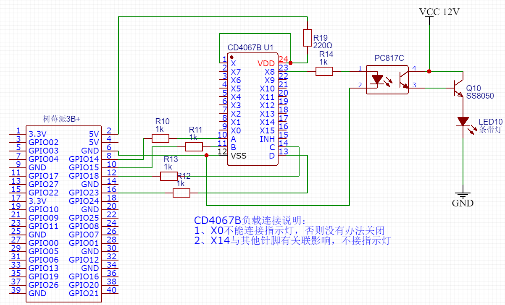

本系统为树莓派控制98路LED指示灯的管理程序，全套硬件成本在300元内。
使用简单的Get请求实现LED灯的常亮、闪烁等各种灵活控制。

## 编译环境说明
基于Go 1.12 + Beego开发，使用go module实现依赖管理，无需依赖GoPATH，第一次执行如下命令即可下载全部依赖：
```bash
go mod tidy
```
如果Go有些模块因众所周知的原因无法安装，请使用：https://goproxy.io/zh/。

## 自动注册
开机后，程序自动注册到调用，注册信息包括MAC地址和能访问的URL地址。
后继使用时，即可使用唯一的MAC地址进行绑定并调用，调用的URL即为注册的url。

## 调用说明
直接使用Get请求即可实现LED灯的点亮、闪烁、关闭等功能，请求地址：http://IP:8080/led/
参数说明如下：
- oid：要打开的led编号，可传入1-98个几个数字（具体数字要看接了多少指示灯）
- cid：要关闭的led编号，可传入1-98个几个数字（具体数字要看接了多少指示灯）
- waittime： 持续亮灯时长，必须配合oid使用
- flashtime：闪烁间隔时间，必须配合oid使用，可配合waittime使用，若为传入waittime，则在默认2秒后关闭（默认值在配置文件中配置）

**PS:** 
1. 一般在使用者的浏览器端实现调用，即使用js调用。因为树莓派所在的wifi可能是服务器端无法访问的。
2. 支持CORS和JSONP两种跨域方式，按需使用即可。

###  调用示例
PHP调用示例如下：
```php
<?php

$request = new HttpRequest();
$request->setUrl('http://192.168.169.246:8080/led/');
$request->setMethod(HTTP_METH_GET);

$request->setQueryData(array(
  'cid' => '20',
  'oid' => '21',
  'waittime' => '1000',
  'flashtime' => '200'
));


try {
  $response = $request->send();

  echo $response->getBody();
} catch (HttpException $ex) {
  echo $ex;
}
```

## 电路原理图



最多可以连接7组LED，共计98灯，详细引脚连接方法请参考：[引脚连接说明](docs/98灯引脚接说明.md)

## CD4067B 多路复用开关芯片说明
CD4067B芯片用于实现多路控制，即4路输入，控制16路输出，其开关特性对应如下：

输入A | 输入B | 输入C | 输入D | 输出 | 异常
--- | --- | --- | --- | --- | --- 
1 | 1 | 1 | 1 | X15| X14
0 | 1 | 1 | 1 | X14| 
1 | 0 | 1 | 1 | X13| 
0 | 0 | 1 | 1 | X12| X14
1 | 1 | 0 | 1 | X11| 
0 | 1 | 0 | 1 | X10| X14
1 | 0 | 0 | 1 | X9 | 
0 | 0 | 0 | 1 | X8 | 
1 | 1 | 1 | 0 | X7 | 
0 | 1 | 1 | 0 | X6 | X14
1 | 0 | 1 | 0 | X5 | 
0 | 0 | 1 | 0 | X4 | 
1 | 1 | 0 | 0 | X3 | 
0 | 1 | 0 | 0 | X2 | 
1 | 0 | 0 | 0 | X1 | 
0 | 0 | 0 | 0 | X0 | 

说明：
1. 由于输入全部为Low的时候，X0会被点亮，这会导致一个结果，如果16个负载全接，则至少有一个指示灯无法关闭
2. 实测情况，当点亮X6、X10、X12和X15时，X14都会被同事点亮，不排除这批芯片本身问题，因此暂时予以排除，实际连接LED时不连接X14，程序中自动适配
3. 同一组灯不能并发（即只能同时点亮一个），但不同组的灯可以同时点亮

## PC8x7 光耦合器说明
PC8x7有PC817、PC827、PC837、PC847四种型号，对应1-4路控制，实现用树莓派和CD4067B微弱的电流和电压控制更高电压电流需求的负载，实现类似继电器的效果。
原理图默认画的是PC817，实际可以根据接的LED数量，按需选择。

##  部署
### 部署目录
将编译好的程序包放入/home/pi路径下，即完整的路径应该如下：
```
root@raspberrypi:/home/pi# tree piled
piled
├── conf
│   └── app.conf
├── logs
│   └── piled.log
├── dos //文档目录
├── piled
```

目录/文件说明：
- conf/app.conf 配置文件，主要配置如下：
    - wms_url：当前仓库wms地址
    - id ： 机器编号，编号需粘贴到机器外部，方便操作员绑定
    - type_id ： 灯的数量，或其他需要识别的类型
- piled 编译后的可执行二进制程序

### 服务配置
我们使用systemd管理服务，先配置服务文件：/etc/systemd/system/piled.service 
```ini
[Unit]
Description=Pi LED
Wants=network-online.target
After=network-online.target

[Service]
User=root
Group=root
Type=simple
ExecStart=/home/pi/piled/piled
Restart=on-failure
RestartSec=3

[Install]
WantedBy=multi-user.target
```

配置好后添加到开机自启动并立即启动：
```
#重新加载systemd配置
systemctl daemon-reload
#加入开机自启动
systemctl enable piled
#启动服务
systemctl start piled
#查看状态
systemctl status piled
```

## 手动更新
更新步骤：
1、进入工作目录：
```bash
cd /home/pi/piled
```
2、停止服务：
```bash
sudo systemctl stop piled
```
3、重命名原程序
```bash
sudo mv  /home/pi/piled/piled /home/pi/piled/piled_bak
```
4、使用xftp上传新程序
5、修改文件可执行权限
```bash
chmod +x /home/pi/piled/piled
```
6、启动服务
```bash
sudo  systemct start piled
```
7、查看服务状态
```bash
sudo  systemct status piled
```

## 其他说明

- [引脚连接说明](docs/98灯引脚接说明.md)
- [树莓派wifi和ssh配置](docs/树莓派wifi和ssh配置.md)
- [自动更新配置](docs/自动更新配置.md)
- [硬件配置清单](docs/硬件配置清单.md)
- [CD4067B芯片文档](docs/CD4067B.pdf)
- [PC8X7C芯片文档](docs/PC8X7C.pdf)
